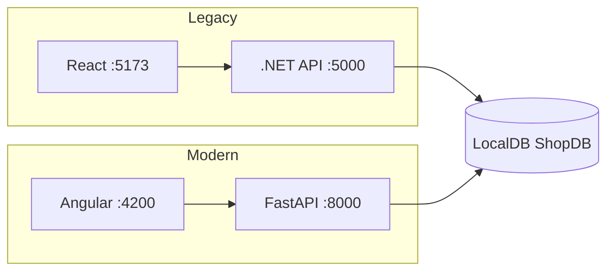
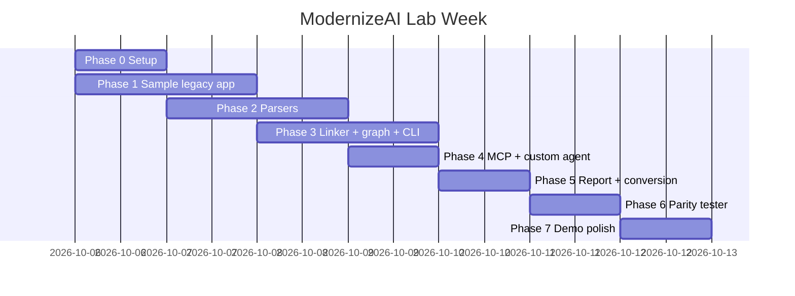

# ModernizeAI: Project Context & Implementation Plan

> **For GitHub Copilot (and the developer):** this file is the single source of truth for the project.
> Read it fully before starting any phase. Work **one phase at a time**, in order. After each phase,
> run the "Done when" checks before moving on. If something in this file is ambiguous, pick the
> **simplest option that makes the demo work** and note the decision in the "Decision Log" at the bottom.

---

## 1. The Idea in Plain Words

Next year our company will modernize all its **.NET applications** to a new stack:

| Layer | Today (legacy) | Target |
|---|---|---|
| Frontend | React / ASP.NET MVC | **Angular** |
| Backend | .NET (C#) Web API | **Python (FastAPI)** |
| Database | SQL Server | SQL Server first (on AWS RDS), later PostgreSQL |
| Hosting | On-prem / IIS | **AWS** |

The hardest part of a migration is **understanding the old code**, not writing the new code.
Business logic is spread across three places, each in a different repository:

```
React screen  ──calls──▶  .NET API  ──calls──▶  SQL Server stored procedure  ──reads/writes──▶  tables
```

Some important business rules are hidden in places nobody expects. In our sample app, for example,
a **10% discount for Gold customers is applied inside a stored procedure**, not in the C# code.
A developer who rewrites the API in Python without knowing this will ship a bug.

**ModernizeAI** is an AI assistant that:

1. **Reads** all the repos (frontend + backend) and the database structure **ahead of time**.
2. **Connects** them into one map (a "knowledge graph"): which screen calls which API, which code runs,
   which stored procedure is called, and which tables are touched.
3. Lets developers **ask plain-English questions inside VS Code** (through a custom GitHub Copilot agent)
   and get answers that trace **from the frontend all the way to the database**.
4. Helps **plan** the migration (complexity, dependencies, risks, what maps to what in Angular/Python/AWS).
5. Helps **implement** it (first-draft FastAPI and Angular code that follows our standards).
6. **Verifies** the result by calling the old API and the new API with the same requests and comparing
   the answers (a "parity test").

### Why not just use Copilot Chat?
Plain Copilot Chat only sees the repo that is open. It cannot see that the React screen's request ends up
in a stored procedure in a different system. ModernizeAI gives Copilot **shared, persistent knowledge of
all repos plus the database**, through tools it can call.

---

## 2. Goal for Lab Week (Deadline: **October 12**)

Build a **working prototype** on a **small sample application** (built by us) that demonstrates, end to end:

1. ✅ A **runnable sample legacy app**: React (Vite) UI + .NET Web API + **local SQL Server (LocalDB)** with a hidden business rule.
2. ✅ A **portfolio registry** (`portfolio.yaml`) listing the repos and database.
3. ✅ An **indexer** that parses React, C# and SQL and builds a linked **knowledge graph** (saved as JSON).
4. ✅ An **MCP server** that exposes graph queries as tools to GitHub Copilot.
5. ✅ A **custom Copilot agent** ("Modernizer") that uses those tools to answer full-stack questions.
6. ✅ A **migration plan report** for the sample app.
7. ✅ A **fully migrated, runnable modern app**: all API endpoints converted (C# → FastAPI) and all screens converted (React → Angular), using the Modernizer agent.
8. ✅ A **parity tester** that compares the legacy and new APIs and **catches the missing Gold discount**.
9. ✅ **Side-by-side demo**: the old React app (port 5173) and the new Angular app (port 4200) running against the same database.

**Out of scope for lab week:** real company repos, AWS deployment, authentication, vector databases,
a web UI for the tool itself. Keep it small and working.

---

## 3. Glossary (Read This First)

| Term | Meaning |
|---|---|
| **Legacy app** | The old system we are migrating from (here: our sample React + .NET + SQL Server app). |
| **Portfolio** | The full list of applications, their repos and databases. Stored in `portfolio.yaml`. |
| **Indexer** | A Python program that reads source code and database structure and extracts facts. |
| **Parser** | The part of the indexer that understands one kind of source (React, C#, or SQL). |
| **Linker** | The part that connects facts across sources (React URL → C# route, C# code → stored procedure). |
| **Knowledge graph** | A network of **nodes** (things: screens, APIs, classes, procs, tables) and **edges** (relationships: "calls", "reads"). Saved as `output/graph.json`. |
| **MCP (Model Context Protocol)** | A standard way to give Copilot extra tools. We write a small Python **MCP server**; Copilot calls its functions. |
| **Custom agent** | A `.agent.md` file that gives Copilot a specific role, instructions and allowed tools. Appears in the Copilot Chat agent picker. |
| **Stored procedure (proc)** | SQL code saved inside the database, called by name from application code. |
| **Parity test** | Send the same request to the old and new API and check the responses match. |
| **FastAPI** | The Python web framework we use for the new backend. |
| **LocalDB** | A lightweight SQL Server that ships with Visual Studio / SQL tools. Server name: `(localdb)\MSSQLLocalDB`. Uses Windows login (no password). |
| **Vite** | Dev server/build tool for the legacy React app. |
| **Proxy** | Both UIs call relative `/api/...` URLs; the dev server forwards them to the backend (avoids CORS issues). |

---

## 4. Tech Stack & Prerequisites

### Install on the developer machine
| Tool | Why | Check command |
|---|---|---|
| **Python 3.11+** | Indexer, MCP server, new FastAPI backend, parity tester | `python --version` |
| **SQL Server LocalDB** | The legacy database (local, no Docker) | `sqllocaldb info` → shows `MSSQLLocalDB` |
| **sqlcmd** | Runs `init.sql` to create/reset the database | `sqlcmd -?` |
| **ODBC Driver 18 for SQL Server** | Python → SQL Server connection | `Get-OdbcDriver \| ? Name -like '*SQL Server*'` |
| **.NET SDK 8+** | Legacy Web API | `dotnet --list-sdks` |
| **Node.js 20+** | Legacy React app + new Angular app | `node --version` |
| **VS Code + GitHub Copilot** (Agent mode enabled, MCP enabled) | Runs the custom agent | Copilot Chat → agent picker visible |
| **Git** | Version control | `git --version` |

> **Verified on the target laptop (Oct 6):** LocalDB `MSSQLLocalDB`, sqlcmd, ODBC Driver 17 & 18, .NET SDK 10.0.301,
> Node 24.18, Python 3.14.6. Angular CLI is not installed globally, so use `npx @angular/cli@latest ...`.
> Docker is installed but its engine was not running, so **this plan uses LocalDB, not Docker**.
> If a Python package fails to install on 3.14 (no wheel yet), install Python 3.12 or 3.13 and recreate `.venv`.

### Python packages (`requirements.txt`)
```
networkx          # knowledge graph
pyyaml            # read portfolio.yaml
pyodbc            # connect to SQL Server / LocalDB (pymssql cannot connect to LocalDB)
mcp               # MCP server SDK (FastMCP)
httpx             # parity tester HTTP calls
fastapi           # new Python backend
uvicorn           # run FastAPI
sqlalchemy        # DB access in new backend
python-dotenv     # load .env
typer             # simple CLI
pytest            # tests
```

---

## 5. Target Folder Structure

Create exactly this layout (Copilot: do not invent a different one):

```
modernize-ai/
├── PROJECT_CONTEXT.md                 # this file
├── README.md                          # how to run (short)
├── .env.example                       # SQL password etc. (copy to .env, never commit .env)
├── .gitignore
├── requirements.txt
├── portfolio.yaml                     # the portfolio registry
├── scripts/
│   ├── setup-db.ps1                   # create/reset ShopDB on LocalDB via sqlcmd
│   ├── start-legacy.ps1               # start .NET API (5000) + React UI (5173)
│   └── start-modern.ps1               # start FastAPI (8000) + Angular UI (4200)
│
├── sample-legacy/                     # THE OLD SYSTEM (we build it to have something to migrate)
│   ├── database/
│   │   └── init.sql                   # tables, seed data, stored procedures, view
│   ├── shop-api/                      # .NET Web API (controllers → services → repositories → procs)
│   │   ├── ShopApi.csproj
│   │   ├── appsettings.json           # LocalDB connection string (Windows auth, no password)
│   │   ├── Program.cs
│   │   ├── Controllers/  OrdersController.cs, CustomersController.cs, ProductsController.cs
│   │   ├── Services/     IOrderService.cs, OrderService.cs, ICustomerService.cs, CustomerService.cs
│   │   ├── Repositories/ IOrderRepository.cs, OrderRepository.cs, ProductRepository.cs
│   │   └── Models/       Order.cs, OrderItem.cs, Customer.cs, Product.cs
│   ├── shop-ui/                       # React + TypeScript (Vite), RUNNABLE on port 5173
│   │   ├── package.json, vite.config.ts (proxy /api → http://localhost:5000), index.html
│   │   └── src/
│   │       ├── main.tsx, App.tsx      # react-router routes + simple nav bar
│   │       ├── api/client.ts
│   │       └── pages/ OrderDetails.tsx, CustomerOrders.tsx, ProductList.tsx
│   └── reports-batch/                 # tiny .NET console app that ALSO uses the Orders table
│       └── DailySalesReport.cs
│
├── modernizer/                        # OUR TOOL (Python package)
│   ├── __init__.py
│   ├── config.py                      # loads portfolio.yaml + .env
│   ├── graph_store.py                 # create/save/load the NetworkX graph
│   ├── parsers/
│   │   ├── __init__.py
│   │   ├── react_parser.py
│   │   ├── dotnet_parser.py
│   │   └── sql_parser.py
│   ├── linker.py                      # connects facts across sources
│   ├── queries.py                     # trace_feature, get_dependents, search, etc. (pure functions)
│   ├── indexer.py                     # orchestrates parsers + linker → output/graph.json
│   ├── report.py                      # inventory + migration plan report (markdown)
│   ├── parity.py                      # parity tester
│   ├── cli.py                         # `python -m modernizer.cli index|trace|dependents|report|parity`
│   └── mcp_server.py                  # exposes queries as MCP tools
│
├── migrated/                          # THE NEW SYSTEM (generated with the agent's help)
│   ├── shop-api-python/               # FastAPI
│   │   ├── app/main.py, app/routers/orders.py, app/db.py, app/schemas.py
│   │   └── requirements.txt
│   └── shop-ui-angular/               # Angular app (created with Angular CLI), RUNNABLE on port 4200
│       ├── proxy.conf.json            # /api → http://localhost:8000
│       └── src/app/
│           ├── app.routes.ts
│           ├── models/ order.model.ts, product.model.ts
│           ├── services/ order.service.ts, customer.service.ts, product.service.ts
│           └── pages/ order-details/, customer-orders/, product-list/
│
├── parity/
│   └── cases.yaml                     # parity test cases
│
├── output/                            # generated: graph.json, reports/*.md (gitignored except samples)
│
├── tests/                             # pytest tests for parsers, linker, queries
│
├── .vscode/
│   └── mcp.json                       # registers our MCP server with VS Code Copilot
└── .github/
    ├── copilot-instructions.md        # short pointer to this file + coding rules
    ├── agents/
    │   └── modernizer.agent.md        # the custom "Modernizer" agent
    └── instructions/
        └── migration-mapping.instructions.md   # .NET → Python/Angular/AWS mapping rules
```

---

## 6. The Sample Legacy App (What We Migrate)

We build a tiny **online shop** on purpose, with realistic layering and a **hidden business rule**.

### 6.1 Database: `sample-legacy/database/init.sql` (database name `ShopDB`)

**Tables**
| Table | Columns |
|---|---|
| `Customers` | `Id INT PK`, `Name NVARCHAR(100)`, `Tier NVARCHAR(20)` (`'Standard'` or `'Gold'`) |
| `Products` | `Id INT PK`, `Name NVARCHAR(100)`, `Price DECIMAL(10,2)` |
| `Orders` | `Id INT PK`, `CustomerId INT FK`, `Status NVARCHAR(20)` (`'New'`,`'Shipped'`,`'Cancelled'`), `CreatedAt DATETIME2` |
| `OrderItems` | `Id INT PK`, `OrderId INT FK`, `ProductId INT FK`, `Quantity INT`, `UnitPrice DECIMAL(10,2)` |

**Seed data (must exist for the demo)**
- Customer 1: `Alice`, `Standard`
- Customer 2: `Bob`, `Gold`
- 3 products
- Order 1 → Alice, status `New`, 2 items (subtotal e.g. 450.00)
- Order 2 → Bob, status `New`, same 2 items (subtotal 450.00 → **total 405.00 after Gold discount**)
- Order 3 → Alice, status `Shipped`

**Stored procedures (the hidden logic lives here)**
| Proc | Behavior |
|---|---|
| `usp_GetOrderById @OrderId` | Returns order header + customer name + items. **Total = SUM(Quantity × UnitPrice), and if `Customers.Tier = 'Gold'` multiply by 0.90** ← the hidden rule |
| `usp_GetOrdersByCustomer @CustomerId` | Lists orders for a customer |
| `usp_CancelOrder @OrderId` | Sets `Status = 'Cancelled'`. **Raises an error if status is `'Shipped'`** ← second hidden rule |

**View**
- `vw_DailySales`: totals per day from `Orders` + `OrderItems` (used by `reports-batch`).

The script must be **re-runnable** (drop/create database or `IF NOT EXISTS` guards).

### 6.2 Legacy backend: `sample-legacy/shop-api` (.NET Web API, Dapper)

Target framework: the newest installed SDK (`dotnet --list-sdks`; currently .NET 10 → `net10.0`). Packages: `Dapper`, `Microsoft.Data.SqlClient`.

Classic layering: **Controller → Service → Repository → Stored procedure**.

| HTTP | Route | Controller method | Service | Repository | SQL |
|---|---|---|---|---|---|
| GET | `/api/orders/{id:int}` | `OrdersController.GetOrder` | `OrderService.GetOrder` | `OrderRepository.GetById` | `usp_GetOrderById` |
| POST | `/api/orders/{id:int}/cancel` | `OrdersController.CancelOrder` | `OrderService.CancelOrder` | `OrderRepository.Cancel` | `usp_CancelOrder` |
| GET | `/api/customers/{id:int}/orders` | `CustomersController.GetOrders` | `CustomerService.GetOrders` | `OrderRepository.GetByCustomer` | `usp_GetOrdersByCustomer` |
| GET | `/api/products` | `ProductsController.GetAll` | (none) | `ProductRepository.GetAll` | **inline SQL**: `SELECT Id, Name, Price FROM Products` |

Rules:
- Use attribute routing: `[Route("api/orders")]` on the class, `[HttpGet("{id:int}")]` on methods.
- Use **constructor injection** with interfaces (`IOrderService`, `IOrderRepository`).
- Call procs with Dapper: `conn.QueryAsync<...>("usp_GetOrderById", new { OrderId = id }, commandType: CommandType.StoredProcedure)`.
- JSON response shape for `GET /api/orders/{id}` (camelCase, **the Python version must match exactly**):
  ```json
  { "orderId": 2, "customerName": "Bob", "status": "New", "total": 405.00,
    "items": [ { "productName": "Keyboard", "quantity": 1, "unitPrice": 150.00 } ] }
  ```
- Runs with `dotnet run --urls http://localhost:5000`.
- Connection string in `appsettings.json` → `ConnectionStrings:ShopDB` =
  `Server=(localdb)\\MSSQLLocalDB;Database=ShopDB;Trusted_Connection=True;TrustServerCertificate=True`
  (Windows auth, so there's no password to protect).
- Errors raised by `usp_CancelOrder` (`THROW`) are returned as **HTTP 409** with JSON `{ "error": "<message>" }`; a missing order returns **404**.

### 6.3 Legacy frontend: `sample-legacy/shop-ui` (React + TypeScript + Vite, runnable)

Create with `npm create vite@latest shop-ui -- --template react-ts`, then add `axios` and `react-router-dom`.
`vite.config.ts` proxies `/api` → `http://localhost:5000`, so the UI uses relative URLs and no CORS setup is needed.

Routes and screens (keep the styling plain, e.g. a simple table plus a nav bar):
| Route | Page | Shows |
|---|---|---|
| `/products` | `ProductList` | table of products |
| `/customers/:customerId/orders` | `CustomerOrders` | the customer's orders, each linking to its details |
| `/orders/:id` | `OrderDetails` | customer, status, items, **total**, and a **Cancel** button that shows the API error message if it fails |

Nav bar links: Products · Alice's orders (`/customers/1/orders`) · Bob's orders (`/customers/2/orders`).

API calls (the parser depends on these exact patterns):

| File | API calls it makes |
|---|---|
| `src/api/client.ts` | `axios.create({ baseURL: import.meta.env.VITE_API_URL })` |
| `src/pages/OrderDetails.tsx` | `client.get(\`/api/orders/${id}\`)` and a Cancel button → `client.post(\`/api/orders/${id}/cancel\`)` |
| `src/pages/CustomerOrders.tsx` | `client.get(\`/api/customers/${customerId}/orders\`)` |
| `src/pages/ProductList.tsx` | `fetch('/api/products')` (deliberately uses `fetch` instead of axios, to test both patterns) |

Runs with `npm run dev` on **http://localhost:5173**.

### 6.4 Second app: `sample-legacy/reports-batch`
One C# file, `DailySalesReport.cs`, that runs inline SQL: `SELECT ... FROM vw_DailySales` and
`UPDATE Orders SET ...` (anything that touches `Orders`). This proves **cross-application impact**:
"changing `Orders` also affects the Reporting app".

### 6.5 Local run scripts (no Docker)
- `scripts/setup-db.ps1`: `sqllocaldb start MSSQLLocalDB`, then
  `sqlcmd -S "(localdb)\MSSQLLocalDB" -E -i sample-legacy\database\init.sql`.
  `init.sql` must be re-runnable: if `ShopDB` exists, run `ALTER DATABASE ShopDB SET SINGLE_USER WITH ROLLBACK IMMEDIATE`, drop it, then recreate.
- `scripts/start-legacy.ps1`: starts the .NET API (`dotnet run --urls http://localhost:5000`) and the React app (`npm run dev`), each in its own window (`Start-Process powershell -ArgumentList '-NoExit', ...`).
- `scripts/start-modern.ps1`: starts FastAPI (`uvicorn app.main:app --port 8000`) and Angular (`npx ng serve --port 4200 --proxy-config proxy.conf.json`), each in its own window.

### 6.6 The Target Modern App (Built in Phase 5 with the Modernizer Agent)
This is the **result of the migration**. It must look and behave like the legacy app.

**`migrated/shop-api-python` (FastAPI, port 8000)**
- Same 4 endpoints, same paths, same status codes (404 / 409), and **same camelCase JSON** as section 6.2.
- `app/db.py`: SQLAlchemy engine using `mssql+pyodbc` with `SHOPDB_CONN` from `.env`.
- `app/routers/orders.py`, `customers.py`, `products.py`; `app/schemas.py` holds the Pydantic models.

**`migrated/shop-ui-angular` (Angular, port 4200)**
- Created with `npx @angular/cli@latest new shop-ui-angular --routing --style=css --skip-git --ssr=false`.
- Standalone components, one per legacy page: `ProductListComponent`, `CustomerOrdersComponent`, `OrderDetailsComponent`.
- **Same routes, nav bar and behavior** as the React app (section 6.3), including the Cancel button and its error message.
- Services use `HttpClient` with relative `/api/...` URLs; `proxy.conf.json` forwards `/api` → `http://localhost:8000`.

**Demo picture:** old React (5173 → .NET 5000) and new Angular (4200 → FastAPI 8000), side by side, both reading the same `ShopDB`.



---

## 7. The Portfolio Registry: `portfolio.yaml`

```yaml
portfolio: acme-dotnet-modernization

defaults:
  target_stack:
    frontend: angular
    backend: python-fastapi
    cloud: aws

applications:
  - name: OnlineShop
    owner: team-commerce
    migration: { wave: 2, status: planning }
    repos:
      - { name: shop-ui,  path: sample-legacy/shop-ui,  type: react }
      - { name: shop-api, path: sample-legacy/shop-api, type: dotnet }
    databases:
      - { name: ShopDB, type: sqlserver, connection_env: SHOPDB_CONN, mode: schema-only }

  - name: Reporting
    owner: team-analytics
    migration: { wave: 1, status: not-started }
    repos:
      - { name: reports-batch, path: sample-legacy/reports-batch, type: dotnet }
    databases:
      - { name: ShopDB, type: sqlserver, connection_env: SHOPDB_CONN, mode: schema-only }
```

- For the prototype, repos are **local folders** (`path`). In the future this can be `url` (git clone).
- `connection_env` is the **name of an environment variable** holding the connection info. **Never put passwords in YAML.**
- The same database listed under two apps means a **shared dependency**, so the indexer must create it only once.

`.env.example`:
```
SHOPDB_CONN=DRIVER={ODBC Driver 18 for SQL Server};SERVER=(localdb)\MSSQLLocalDB;DATABASE=ShopDB;Trusted_Connection=yes;TrustServerCertificate=yes
SQL_SERVER_INSTANCE=(localdb)\MSSQLLocalDB
LEGACY_API_URL=http://localhost:5000
NEW_API_URL=http://localhost:8000
```

> For SQLAlchemy, build the URL as `mssql+pyodbc:///?odbc_connect=` + `urllib.parse.quote_plus(SHOPDB_CONN)`.

> **Security note:** in real use, the indexer must use a **read-only login with only `VIEW DEFINITION`**
> permission (schema-only, no customer data). For the prototype, Windows auth on a local LocalDB is acceptable.

---

## 8. The Knowledge Graph Design

Use **NetworkX `MultiDiGraph`**, saved to `output/graph.json` using `networkx.node_link_data`.

### 8.1 Node IDs and types
Every node has: `id` (unique string), `type`, `name`, `app`, `repo` (if any), `file` (relative path, if any), `line` (if any), plus type-specific attributes.

| `type` | ID format (example) | Extra attributes |
|---|---|---|
| `Application` | `app:OnlineShop` | `owner`, `wave`, `status` |
| `Repo` | `repo:shop-api` | `repo_type` |
| `Database` | `db:ShopDB` | |
| `UIComponent` | `ui:shop-ui:OrderDetails` | |
| `ApiCall` | `apicall:shop-ui:OrderDetails:GET:/api/orders/{}` | `method`, `raw_url`, `normalized_url` |
| `ApiEndpoint` | `endpoint:shop-api:GET:/api/orders/{}` | `method`, `route`, `normalized_url`, `handler` |
| `CSharpClass` | `class:shop-api:OrderService` | `kind` (`controller`/`service`/`repository`/`other`) |
| `CSharpMethod` | `method:shop-api:OrderService.GetOrder` | `signature` |
| `StoredProcedure` | `proc:ShopDB:usp_GetOrderById` | `definition` (full SQL text) |
| `View` | `view:ShopDB:vw_DailySales` | `definition` |
| `Table` | `table:ShopDB:Orders` | `columns` (list of `{name,type}`) |

### 8.2 Edge types
| Edge | From → To | Meaning |
|---|---|---|
| `CONTAINS` | App→Repo, App→Database, Repo→UIComponent/CSharpClass, Class→Method | ownership |
| `MAKES_CALL` | UIComponent → ApiCall | screen issues an HTTP request |
| `HANDLED_BY` | ApiCall → ApiEndpoint | **cross-repo link** (frontend → backend) |
| `IMPLEMENTED_BY` | ApiEndpoint → CSharpMethod | the controller method serving the route |
| `CALLS` | CSharpMethod → CSharpMethod (or Class → Class) | code call chain |
| `EXECUTES` | CSharpMethod/Class → StoredProcedure | **cross-boundary link** (code → DB) |
| `READS` | Proc/View/Method/Class → Table/View | SELECT / JOIN |
| `WRITES` | Proc/Method/Class → Table | INSERT / UPDATE / DELETE |

Every cross-source edge has a `confidence` attribute: `exact`, `inferred`, or `unresolved`.

### 8.3 Example: what the graph must contain for the demo
```
ui:shop-ui:OrderDetails
  └─MAKES_CALL─▶ apicall:...GET:/api/orders/{}
       └─HANDLED_BY─▶ endpoint:shop-api:GET:/api/orders/{}
            └─IMPLEMENTED_BY─▶ method:shop-api:OrdersController.GetOrder
                 └─CALLS─▶ method:shop-api:OrderService.GetOrder
                      └─CALLS─▶ method:shop-api:OrderRepository.GetById
                           └─EXECUTES─▶ proc:ShopDB:usp_GetOrderById
                                ├─READS─▶ table:ShopDB:Orders
                                ├─READS─▶ table:ShopDB:OrderItems
                                ├─READS─▶ table:ShopDB:Customers
                                └─READS─▶ table:ShopDB:Products
```

---

## 9. How Each Part Works (Technical Spec)

> Keep it simple: **regular expressions are fine** for the prototype. Do not add Roslyn, tree-sitter or LLM
> calls inside the indexer unless regex clearly fails. The indexer must be **deterministic** (same input → same graph).

### 9.1 React parser (`parsers/react_parser.py`)
- Scan `**/*.ts, *.tsx, *.js, *.jsx` under the repo path (skip `node_modules`).
- Component name = file name without extension (e.g. `OrderDetails`).
- Detect calls:
  - `client.get(...)`, `axios.post(...)`, any `<identifier>.(get|post|put|delete|patch)(` with a string or template-literal first argument.
  - `fetch('...')` / `fetch(\`...\`)` → method is `GET` unless `{ method: 'POST' }` follows.
- Return a list of `ApiCallFact(component, file, line, method, raw_url)`.

### 9.2 .NET parser (`parsers/dotnet_parser.py`)
- Scan `**/*.cs` (skip `bin`, `obj`).
- For each class: name, file, line, `kind` (name ends with `Controller` / `Service` / `Repository`).
- **Routes:** class-level `[Route("...")]` + method-level `[HttpGet("...")]`, `[HttpPost("...")]`, etc. → combined route. Replace `[controller]` with the class name minus `Controller`, lowercased.
- **Methods:** detect method declarations and capture each method **body** (use brace counting from the opening `{`).
- **Dependency injection:** constructor parameters such as `IOrderService orderService` → field type map.
  Interface `IOrderService` resolves to class `OrderService` (drop leading `I`).
- **Calls:** inside a method body, `_orderService.GetOrder(` → `CALLS` the method `OrderService.GetOrder`
  (resolve the field `_orderService` via the DI map).
- **SQL usage:** every string literal in a method body:
  - If it equals a known **proc name** from the DB (or starts with `usp_`) → `EXECUTES` that proc.
  - If it contains `SELECT|INSERT|UPDATE|DELETE` → treat it as inline SQL, extract tables (see 9.3) → `READS`/`WRITES`.

### 9.3 SQL parser (`parsers/sql_parser.py`)
Connect with `pyodbc.connect(os.environ["SHOPDB_CONN"])`. Run **read-only catalog queries**:
```sql
-- tables + columns
SELECT t.name AS table_name, c.name AS column_name, ty.name AS data_type
FROM sys.tables t
JOIN sys.columns c ON c.object_id = t.object_id
JOIN sys.types ty ON ty.user_type_id = c.user_type_id;

-- procs, views, functions with their SQL text
SELECT o.name, o.type_desc, m.definition
FROM sys.sql_modules m JOIN sys.objects o ON o.object_id = m.object_id;
```
- For each proc/view definition, extract table usage with regex (case-insensitive):
  - **READS:** `FROM <name>`, `JOIN <name>`
  - **WRITES:** `INSERT INTO <name>`, `UPDATE <name>`, `DELETE FROM <name>`
  - Strip `dbo.`, brackets `[ ]`, and aliases.
- The same helper `extract_tables(sql) -> (reads, writes)` is reused for inline SQL in C#.
- **Fallback (no DB available):** parse `sample-legacy/database/init.sql` directly with the same regexes. Implement this so tests run without a database.

### 9.4 Linker (`linker.py`)
1. **Normalize URLs** on both sides with one function `normalize_url(url) -> str`:
   - remove base URL / host, lowercase, strip trailing `/`
   - `${anything}` → `{}`; `{id:int}` / `{id}` → `{}`
   - examples: `` `/api/orders/${id}/cancel` `` → `/api/orders/{}/cancel`; `api/orders/{id:int}` → `/api/orders/{}`
2. **ApiCall → ApiEndpoint:** match on `(method, normalized_url)` → `HANDLED_BY`, `confidence=exact`.
   If there's no match, keep the ApiCall with an `unresolved` flag (shown in reports).
3. **Code → Proc:** match string literals to proc nodes → `EXECUTES`, `confidence=exact`.
4. **Inline SQL → Table:** `READS`/`WRITES`, `confidence=inferred`.

### 9.5 Queries (`queries.py`): pure functions used by CLI and MCP
| Function | Returns |
|---|---|
| `list_applications()` | apps with repos, DBs, wave, status |
| `trace_feature(name)` | the downstream path from a UI component, endpoint, or method down to tables (a tree + a flat list), **including proc definitions** so business rules are visible |
| `get_dependents(name)` | everything **upstream** of a table/proc/class across all apps (procs, views, methods, endpoints, UI components, apps) |
| `get_definition(name)` | source code / SQL text + file + line |
| `search(text)` | nodes whose name or source contains the text (simple keyword search) |
| `app_summary(app)` | counts (components, endpoints, classes, procs, tables), unresolved links, shared DBs |

`name` matching is **case-insensitive** and accepts short names (`OrderDetails`, `Orders`, `usp_GetOrderById`).

### 9.6 MCP server (`mcp_server.py`)
Use the official Python SDK:
```python
from mcp.server.fastmcp import FastMCP
mcp = FastMCP("modernizer")

@mcp.tool()
def trace_feature(name: str) -> dict:
    """Trace a UI component, API endpoint, or C# method down to the database tables it touches."""
    ...

if __name__ == "__main__":
    mcp.run()  # stdio
```
Expose tools: `list_applications`, `trace_feature`, `get_dependents`, `get_definition`, `search_code`,
`app_summary`, `run_parity_tests`. Load `output/graph.json` once at start. Tool docstrings matter: **Copilot reads them** to decide which tool to call.

Register in `.vscode/mcp.json`:
```json
{
  "servers": {
    "modernizer": {
      "type": "stdio",
      "command": "${workspaceFolder}/.venv/Scripts/python.exe",
      "args": ["-m", "modernizer.mcp_server"],
      "cwd": "${workspaceFolder}"
    }
  }
}
```

### 9.7 Custom agent (`.github/agents/modernizer.agent.md`)
```markdown
---
description: Legacy .NET modernization assistant. Answers full-stack questions (UI → API → code → stored procs → tables) using the portfolio knowledge graph, plans migrations, and converts code to Angular / Python FastAPI / AWS.
tools: ['modernizer/*', 'codebase', 'search', 'editFiles', 'runCommands']
---
You are Modernizer...
(rules: ALWAYS call modernizer tools before answering questions about legacy code;
 always cite file + line; always surface business rules found in stored procedures;
 flag unresolved links; follow .github/instructions/migration-mapping.instructions.md when converting;
 never invent code that is not in the graph.)
```
> Tool names in the `tools:` list vary between VS Code versions. If a name is not recognized, open the agent
> in VS Code and use **Configure Tools** to select the `modernizer` MCP tools plus edit/terminal tools.

### 9.8 Mapping rules (`.github/instructions/migration-mapping.instructions.md`)
| Legacy | Target |
|---|---|
| ASP.NET controller | FastAPI `APIRouter` in `app/routers/<name>.py` |
| Constructor DI | FastAPI `Depends(...)` |
| C# model / DTO | Pydantic model in `app/schemas.py` (**keep the same camelCase JSON field names**, using `alias` / `populate_by_name`) |
| Dapper + stored proc | SQLAlchemy `text("EXEC usp_X :p")` (Wave 1: keep procs) |
| Inline SQL | SQLAlchemy `text(...)` with bound parameters (never string-concatenate SQL) |
| `NotFound()` | `HTTPException(404)` |
| SQL `RAISERROR` / `THROW` business errors | `HTTPException(409)` with the same message |
| React page | Angular **standalone** component + `inject(HttpClient)` service + TypeScript interface |
| `useEffect` + axios | Angular service returning `Observable`, `toSignal` in the component |
| `react-router-dom` routes / `useParams` | Angular `Routes` in `app.routes.ts` / `ActivatedRoute` (or `input()` with `withComponentInputBinding`) |
| Vite dev proxy (`vite.config.ts`) | Angular dev proxy (`proxy.conf.json`) |
| `useState` | Angular `signal()` |
| `web.config` / `appsettings.json` secrets | AWS Secrets Manager / SSM Parameter Store (env vars locally) |
| MSMQ / queues | Amazon SQS |
| Windows Service / scheduled job | AWS Lambda + EventBridge Scheduler |
| IIS-hosted API | Container on Amazon ECS Fargate behind ALB / API Gateway |
| SQL Server | Amazon RDS for SQL Server (Wave 1) → Aurora PostgreSQL (later) |

### 9.9 Report (`report.py`) → `output/reports/<App>-migration-plan.md`
Generated **deterministically from the graph** (no LLM needed), containing:
1. Inventory (repos, components, endpoints, classes, procs, tables, LOC)
2. End-to-end feature map (each UI component → endpoint → proc → tables)
3. **Business rules hidden in the database** (procs whose definitions contain `IF`, `CASE`, `RAISERROR`, `THROW`, or arithmetic on totals → flagged with the snippet)
4. Shared dependencies (tables used by more than one app)
5. Target mapping per component (using the table in 9.8)
6. Complexity score per endpoint (simple formula: number of hops + 2 × procs with business rules + 3 × shared tables) → Low/Medium/High
7. Suggested wave order + risks
8. Unresolved links

The agent can then **enrich** this report in chat ("explain the risks in plain English").

### 9.10 Parity tester (`parity.py`)
`parity/cases.yaml`:
```yaml
legacy_base_url: ${LEGACY_API_URL}
new_base_url: ${NEW_API_URL}
ignore_fields: []
numeric_tolerance: 0.01
cases:
  - { name: "Standard customer order", method: GET, path: /api/orders/1 }
  - { name: "Gold customer order",     method: GET, path: /api/orders/2 }
  - { name: "Customer orders list",    method: GET, path: /api/customers/1/orders }
  - { name: "Products",                method: GET, path: /api/products }
  - { name: "Cancel shipped order is rejected", method: POST, path: /api/orders/3/cancel }
```
- For each case, call both APIs with `httpx`, compare **status code** and **JSON body** (deep compare, numeric tolerance).
- Print a table: ✅ / ❌ per case; for ❌ show the differing fields (e.g. `total: legacy=405.00 new=450.00`).
- Write `output/reports/parity-report.md`.
- Exit code 1 if any case fails.
- ⚠️ POST cases change data. Run them last, and reset the DB (re-run `init.sql`) before each full parity run.

### 9.11 The demo story for conversion (important)
To show value, the **first** converted FastAPI version (`v1`) must be written the way a developer would
naturally do it **without** ModernizeAI: compute the total in Python from `OrderItems` with a plain
`SELECT`, **without** the Gold discount. Then:
1. The parity test **fails** on "Gold customer order" (`405.00` vs `450.00`).
2. In chat, ask Modernizer: *"Why does order 2 differ?"* It calls `trace_feature` and finds the discount rule in `usp_GetOrderById`.
3. Fix the code (either call the proc, or port the rule into Python with a comment referencing the proc).
4. Re-run parity: all ✅.

Keep the `v1` version in git history (commit it before fixing) so the demo can be replayed.

---

## 10. Implementation Plan: Phase by Phase

**Timeline:** Tue Oct 6 → Mon Oct 12. Each phase has a goal in plain words, what to build, a **prompt to paste
into Copilot Agent mode**, and "Done when" checks.



> **How to work with Copilot:** open the `modernize-ai` folder in VS Code, switch Copilot Chat to **Agent** mode,
> attach this file (`#PROJECT_CONTEXT.md`), and paste the phase prompt. Let Copilot create files **and run the
> checks**. If a check fails, paste the error back and ask it to fix the issue. Commit to git after each phase.

---

### Phase 0: Project Setup (Oct 6)
**Goal:** an empty but well-organized project that runs.

**Build:** folder structure (section 5), `requirements.txt`, `.gitignore` (ignore `.env`, `.venv`, `output/*`, `bin`, `obj`, `node_modules`),
`.env.example`, Python virtual environment, `README.md` stub, `.github/copilot-instructions.md`
(3–5 lines: "Read PROJECT_CONTEXT.md first; Python 3.11, type hints, small functions; never commit secrets").

**Copilot prompt:**
```text
Read #PROJECT_CONTEXT.md. Execute Phase 0 only: create the folder structure from section 5 (empty files/folders
where content comes in later phases), requirements.txt from section 4, .gitignore, .env.example from section 7,
a short README.md, and .github/copilot-instructions.md. Create a .venv and install requirements. Initialize git.
Then show me the tree and confirm `python -c "import networkx, yaml, mcp, fastapi"` works.
```

**Done when:**
- [x] `.venv` exists and the import check passes
- [x] Folder structure matches section 5
- [x] First git commit made

---

### Phase 1: Build the Sample Legacy App (Oct 6–7)
**Goal:** a realistic "old system" running locally: LocalDB with data and procs, the .NET API answering requests, and a working React UI.

**Build:** sections 6.1–6.5 (database, .NET API, React app, reports-batch, run scripts).

**Copilot prompt:**
```text
Read #PROJECT_CONTEXT.md. Execute Phase 1 only. Build the sample legacy app exactly as specified in sections 6.1-6.5:
6.1 init.sql (re-runnable; tables, seed data incl. Gold customer Bob, procs with the hidden Gold 10% discount and the
"cannot cancel Shipped order" rule, vw_DailySales), 6.2 the .NET Dapper Web API with Controller→Service→
Repository layering, the exact routes/JSON shape and LocalDB connection string, 6.3 the runnable React + Vite app
with the routes, pages, proxy and the exact API call patterns, 6.4 reports-batch/DailySalesReport.cs, and 6.5 the
scripts setup-db.ps1 and start-legacy.ps1. Run setup-db.ps1, build and start the API, and verify with
Invoke-RestMethod that GET /api/orders/1 returns total 450.00, GET /api/orders/2 returns total 405.00, and
POST /api/orders/3/cancel returns 409. Then npm install and build the React app (npm run build) to prove it compiles.
```

**Done when:**
- [x] `scripts/setup-db.ps1` creates `ShopDB` on `(localdb)\MSSQLLocalDB` and can be re-run safely
- [x] `GET http://localhost:5000/api/orders/1` → `total: 450.00` (Alice, Standard)
- [x] `GET http://localhost:5000/api/orders/2` → `total: 405.00` (Bob, Gold) ← the hidden rule works
- [x] `POST /api/orders/3/cancel` → 409 with the "shipped" error message
- [x] `GET /api/products` returns 3 products
- [x] `scripts/start-legacy.ps1` → open http://localhost:5173, browse products, Bob's order shows **405.00**, cancelling order 3 shows the error
- [x] Commit

---

### Phase 2: Parsers, the "Reading" Part (Oct 7–8)
**Goal:** the tool can read each source on its own and list what it found.

**Build:** `config.py`, `portfolio.yaml` (section 7), `parsers/react_parser.py`, `parsers/dotnet_parser.py`,
`parsers/sql_parser.py` (with the `init.sql` fallback), and unit tests in `tests/`.

**Copilot prompt:**
```text
Read #PROJECT_CONTEXT.md. Execute Phase 2 only. Create portfolio.yaml (section 7) and modernizer/config.py to load it
plus .env. Implement the three parsers exactly per sections 9.1, 9.2 and 9.3, returning simple dataclasses (facts),
not graph nodes yet. Include extract_tables(sql) -> (reads, writes) and the init.sql fallback for the SQL parser.
Write pytest tests in tests/ that run WITHOUT a database (use the sample-legacy files and init.sql fallback) asserting:
- React: OrderDetails has GET /api/orders/${id} and POST cancel; ProductList uses fetch GET /api/products
- .NET: route GET api/orders/{id:int} handled by OrdersController.GetOrder; OrderRepository.GetById uses
  usp_GetOrderById; ProductRepository.GetAll has inline SQL reading Products; DI resolves IOrderService→OrderService
- SQL: usp_GetOrderById reads Orders, OrderItems, Customers; usp_CancelOrder writes Orders
Run the tests and fix until green.
```

**Done when:**
- [x] `pytest` passes
- [x] Each parser can be run alone and prints its facts
- [x] Commit

---

### Phase 3: Linker + Knowledge Graph + CLI, the "Connecting" Part (Oct 8–9)
**Goal:** one connected map from screen to table, which can be queried from the terminal.

**Build:** `graph_store.py`, `linker.py`, `indexer.py`, `queries.py`, `cli.py`.

**Copilot prompt:**
```text
Read #PROJECT_CONTEXT.md. Execute Phase 3 only. Implement graph_store.py (NetworkX MultiDiGraph, save/load
output/graph.json), linker.py (section 9.4 incl. normalize_url), indexer.py (reads portfolio.yaml, runs parsers,
builds nodes/edges per section 8, de-duplicates the shared ShopDB), queries.py (section 9.5) and cli.py with typer:
  python -m modernizer.cli index
  python -m modernizer.cli trace OrderDetails
  python -m modernizer.cli dependents Orders
  python -m modernizer.cli definition usp_GetOrderById
  python -m modernizer.cli search discount
Print trace results as an indented tree. Add tests asserting the full chain in section 8.3 exists and that
`dependents Orders` includes usp_GetOrderById, usp_CancelOrder, vw_DailySales, DailySalesReport (Reporting app),
OrderDetails and CustomerOrders (shop-ui). Run everything and fix until green.
```

**Done when:**
- [ ] `python -m modernizer.cli index` creates `output/graph.json`
- [ ] `trace OrderDetails` prints the full chain from section 8.3, including the proc SQL showing the Gold discount
- [ ] `dependents Orders` shows items from **both** OnlineShop and Reporting
- [ ] Zero unresolved API calls for the sample app
- [ ] Tests pass, commit

---

### Phase 4: MCP Server + Custom Copilot Agent, the "Asking" Part (Oct 9)
**Goal:** ask questions in Copilot Chat and get full-stack answers.

**Build:** `mcp_server.py`, `.vscode/mcp.json`, `.github/agents/modernizer.agent.md`,
`.github/instructions/migration-mapping.instructions.md`.

**Copilot prompt:**
```text
Read #PROJECT_CONTEXT.md. Execute Phase 4 only. Implement modernizer/mcp_server.py with FastMCP (section 9.6),
wrapping functions from queries.py, with clear docstrings. Create .vscode/mcp.json, the custom agent
.github/agents/modernizer.agent.md (section 9.7, write full instructions) and
.github/instructions/migration-mapping.instructions.md (section 9.8). Verify the server starts without errors
(python -m modernizer.mcp_server) and explain how I start it in VS Code and select the Modernizer agent.
```

**Manual steps (the human does these):**
1. Open `.vscode/mcp.json` in VS Code and click **Start** above the `modernizer` server.
2. In Copilot Chat, pick the **Modernizer** agent from the agent dropdown.
3. Ask the test questions below.

**Done when the agent correctly answers:**
- [ ] "How is the order total calculated on the Order Details screen?" → mentions the **Gold 10% discount in `usp_GetOrderById`**
- [ ] "What breaks if I rename the Status column in Orders?" → lists procs, C# classes, both apps, and the UI screens
- [ ] "Can a shipped order be cancelled?" → finds the rule in `usp_CancelOrder`
- [ ] **Comparison:** ask the first question in **plain Copilot Chat** with only `shop-ui` open. It should *not* find the discount. Screenshot both for the pitch.
- [ ] Commit

---

### Phase 5: Migration Plan + Code Conversion, the "Planning & Implementing" Part (Oct 10)
**Goal:** a generated migration plan, then the **whole sample app migrated** to FastAPI + Angular and running.

**Build:** `report.py` (section 9.9) and a CLI command `report`; then, **using the Modernizer agent**, generate
the full modern app from section 6.6 (`migrated/shop-api-python` and `migrated/shop-ui-angular`) and `scripts/start-modern.ps1`.

**Copilot prompt (part A: report):**
```text
Read #PROJECT_CONTEXT.md. Execute Phase 5 part A: implement modernizer/report.py per section 9.9 and add
`python -m modernizer.cli report OnlineShop`. Generate output/reports/OnlineShop-migration-plan.md and show it.
It must flag the Gold discount and the cancel rule as hidden business rules, and Orders as a shared table.
```

**Copilot prompt (part B: backend conversion, run in the Modernizer agent):**
```text
Using the modernizer tools and the migration mapping instructions, migrate the shop-api backend to FastAPI in
migrated/shop-api-python as specified in section 6.6: all 4 endpoints (GET /api/orders/{id},
POST /api/orders/{id}/cancel, GET /api/customers/{id}/orders, GET /api/products), port 8000, same JSON field names
and status codes as the legacy API, SQLAlchemy + pyodbc, connection from SHOPDB_CONN.
IMPORTANT for the demo (section 9.11): for GET /api/orders/{id}, implement version v1 by computing the total in
Python from OrderItems with a plain SELECT, WITHOUT calling usp_GetOrderById.
Start it and verify GET http://localhost:8000/api/orders/1 returns 450.00.
```

**Copilot prompt (part C: frontend conversion, run in the Modernizer agent):**
```text
Using the modernizer tools and the migration mapping instructions, migrate the shop-ui React app to Angular in
migrated/shop-ui-angular as specified in section 6.6: create the app with the Angular CLI via npx, convert every
React page (ProductList, CustomerOrders, OrderDetails) to a standalone component with the same routes, nav bar and
behavior (including the Cancel button and error message), add services and models, and proxy.conf.json → port 8000.
Create scripts/start-modern.ps1. Run `npx ng build` to prove it compiles, then start it and confirm the pages load.
```

**Done when:**
- [ ] `output/reports/OnlineShop-migration-plan.md` exists and flags both hidden rules and the shared table
- [ ] FastAPI runs on port 8000 and `GET /api/orders/1` returns `450.00`
- [ ] `GET /api/orders/2` on the new API returns `450.00` (**wrong on purpose**: v1 is missing the discount)
- [ ] Angular app builds and runs on http://localhost:4200 with all 3 pages working
- [ ] Side by side: Bob's order shows **405.00 in the old React app** and **450.00 in the new Angular app** (the bug a real migration could ship)
- [ ] Commit with message `v1 conversion (missing discount - demo)`

---

### Phase 6: Parity Tester, the "Verifying" Part (Oct 11)
**Goal:** automatically prove whether the new system behaves like the old one, and catch the bug.

**Build:** `parity.py` (section 9.10), `parity/cases.yaml`, a CLI command `parity`, the MCP tool `run_parity_tests`.

**Copilot prompt:**
```text
Read #PROJECT_CONTEXT.md. Execute Phase 6: implement modernizer/parity.py per section 9.10, parity/cases.yaml,
`python -m modernizer.cli parity`, and the MCP tool run_parity_tests. Include a `python -m modernizer.cli reset-db`
command that re-runs init.sql by calling sqlcmd (pyodbc cannot run scripts containing GO). Run reset-db then parity
against both running APIs and show the result table.
The Gold customer case is expected to FAIL (405.00 vs 450.00). Do not fix the FastAPI code yet.
```

**Then the demo fix, done in the Modernizer agent chat:**
```text
The parity test for order 2 fails (legacy 405.00, new 450.00). Find out why using the modernizer tools and fix
migrated/shop-api-python accordingly. Then re-run the parity tests.
```

**Done when:**
- [ ] First parity run: Gold case ❌ with a clear diff `total: legacy=405.0 new=450.0`
- [ ] Agent explains the cause (discount in `usp_GetOrderById`) and fixes the code
- [ ] Second parity run: all ✅
- [ ] Refresh the Angular app: Bob's order now shows **405.00**, the same as the React app
- [ ] `output/reports/parity-report.md` written
- [ ] Commit (`v2 conversion - parity passing`)

---

### Phase 7: Demo Polish & Rehearsal (Oct 12)
**Goal:** a smooth, repeatable 8–10 minute demo.

**Tasks:**
- [ ] `README.md`: one-page "how to run from scratch" (setup-db → start-legacy → index → start MCP → ask questions → report → start-modern → parity)
- [ ] A `scripts/demo.ps1` script that resets the DB, re-indexes, and starts both the legacy and the modern apps
- [ ] Rehearse the demo script below twice; **record a backup video**
- [ ] Prepare screenshots: plain Copilot vs Modernizer answer, the graph trace, the migration plan, parity ❌ → ✅
- [ ] (Optional) Render the trace as a Mermaid diagram in the agent's answer

**Demo script (8–10 minutes):**
1. **Problem** (1 min): migrating .NET to Angular/Python/AWS; hidden logic spread across repos and the DB.
2. **The legacy app** (30 s): click through the React app on 5173 and show Bob's order at 405.00.
3. **Portfolio** (30 s): show `portfolio.yaml`, two apps sharing one DB.
4. **Plain Copilot vs Modernizer** (2 min): "How is the order total calculated?" Only Modernizer finds the Gold discount in the stored proc.
5. **Impact analysis** (1 min): "What breaks if I change the Orders table?" Shows the answer across both apps, the procs and the UI screens.
6. **Migration plan** (1 min): open the generated plan; point out hidden rules, the shared table, and the complexity scores.
7. **The migrated app** (1 min): show the Angular app on 4200 next to the React app. Bob's order shows 450.00 vs 405.00, so something is wrong.
8. **Parity + fix** (2 min): run parity → ❌ on the Gold order → ask the agent why → it fixes → parity ✅ → refresh Angular: 405.00.
9. **Next steps** (30 s): pilot on one real application before the modernization program starts.

---

## 11. Stretch Goals (Only If Everything Above Works)
- Mermaid diagram output from `trace_feature`
- A simple HTML view of the graph (e.g. `pyvis`)
- Use `sys.sql_expression_dependencies` to cross-check regex-extracted table usage
- Clone repos from git URLs in `portfolio.yaml`
- Generate a Terraform/CDK skeleton for the AWS target (ECS Fargate + RDS + Secrets Manager)
- Docker setup (`docker-compose.yml`) as an alternative to LocalDB

---

## 12. Rules for Copilot While Implementing
1. **One phase at a time.** Don't start the next phase until the "Done when" checks pass.
2. **Simple over clever.** Regex parsers, NetworkX, JSON file storage. No extra frameworks or databases.
3. **Never hard-code secrets.** Use `.env` (gitignored) and environment variables.
4. **Parameterized SQL only** in the new Python code (no string concatenation).
5. The indexer only runs **read-only** queries against SQL Server.
6. **Run the code and tests** after every change and fix errors before reporting done.
7. Keep function names and file paths **exactly** as given in this document so phases fit together.
8. Python: 3.11, type hints, small functions, `dataclasses` for facts.
9. If a decision is needed that this file doesn't cover, choose the simplest option and add it to the Decision Log.

---

## 13. Troubleshooting
| Problem | Fix |
|---|---|
| `Cannot connect to (localdb)\MSSQLLocalDB` | Run `sqllocaldb start MSSQLLocalDB`; check `sqllocaldb info MSSQLLocalDB` shows `Running`. |
| `init.sql` fails with "database in use" | Stop the .NET API and FastAPI first, or make sure the script uses `SET SINGLE_USER WITH ROLLBACK IMMEDIATE` before `DROP DATABASE`. |
| pyodbc "Data source name not found" | The driver name in `SHOPDB_CONN` must exactly match `Get-OdbcDriver` output (`ODBC Driver 18 for SQL Server`). |
| pip fails on Python 3.14 (no wheel) | Install Python 3.12 or 3.13, recreate `.venv`, reinstall requirements. |
| React/Angular page shows network error | Check the backend is running on the right port and the dev proxy (`vite.config.ts` / `proxy.conf.json`) points to it. |
| `ng` not recognized | Use `npx ng ...` inside the Angular project (no global install needed). |
| MCP server not visible in Copilot | Open `.vscode/mcp.json` → click **Start**; check the Output panel → "MCP"; confirm the `.venv` python path. |
| Agent answers without calling tools | Make agent instructions say "ALWAYS call modernizer tools first"; ensure the tools are enabled in Configure Tools. |
| Parity "Cancel shipped order" changes data | Run `reset-db` before each full parity run. |
| JSON field names differ (`OrderId` vs `orderId`) | Use Pydantic aliases so FastAPI returns the same camelCase as .NET. |

---

## 14. Decision Log
| Date | Decision | Reason |
|---|---|---|
| 2026-10-06 | Regex-based parsers instead of Roslyn/tree-sitter | Enough for the sample app; fits the 1-week window |
| 2026-10-06 | NetworkX + JSON file instead of a graph DB | Zero setup |
| 2026-10-06 | The conversion is done by the Copilot agent itself (no separate LLM API key) | Uses existing Copilot license; no extra approvals |
| 2026-10-06 | LocalDB + local `dotnet run` / `npm run dev` instead of Docker | Already installed on the laptop; Docker engine not running |
| 2026-10-06 | pyodbc instead of pymssql | pymssql cannot connect to LocalDB; ODBC Driver 18 is installed |
| 2026-10-06 | Legacy React app and migrated Angular app are both fully runnable | Side-by-side visual demo of the migration and of the bug the parity test catches |
| 2026-10-06 | Both UIs use relative `/api` URLs with a dev proxy | No CORS configuration needed |
| 2026-10-08 | Phase 0 scaffolds the **full** section-5 tree with `.gitkeep` placeholders, **including** the CLI-scaffolded app roots `sample-legacy/shop-ui` (Vite) and `migrated/shop-ui-angular` (Angular CLI) | Keeps the committed skeleton complete. Phase 1/5: `npm create vite` / `ng new` refuse a non-empty target, so delete the placeholder `.gitkeep`s (or scaffold into a temp dir and move `src/` in) just before running the CLI |
| 2026-10-09 | Phase 3 `graph_store` IDs are `type:scope:name` strings with one builder per node type; edges keyed by `rel` so one edge of each kind exists between a node pair (a proc that both reads and writes a table keeps separate `READS`/`WRITES` edges) | Deterministic, de-duplicated graph that round-trips through `output/graph.json` |
| 2026-10-09 | `Database` node `CONTAINS` its tables/procs/views (section 8.2 only listed `App→Database`) | Structural completeness so the report/MCP can navigate a DB; `CONTAINS` is excluded from trace/dependents traversal so it does not affect those results |
| 2026-10-09 | `get_dependents` walks the flow edges (`MAKES_CALL/HANDLED_BY/IMPLEMENTED_BY/CALLS/EXECUTES/READS/WRITES`) **backwards**, then adds each reached node's owning `Application` | Gives "everything upstream … across all apps" (section 9.5) so a shared table like `Orders` surfaces both OnlineShop and Reporting without pulling in Repo/Database nodes |
| 2026-10-09 | `init.sql` fallback keeps routine **comments** in the stored `definition` (regex spans found on comment-blanked text slice the original text, whose offsets are preserved) | `search discount` and the migration report can see business-rule notes; table extraction still blanks comments internally |
| | | |
